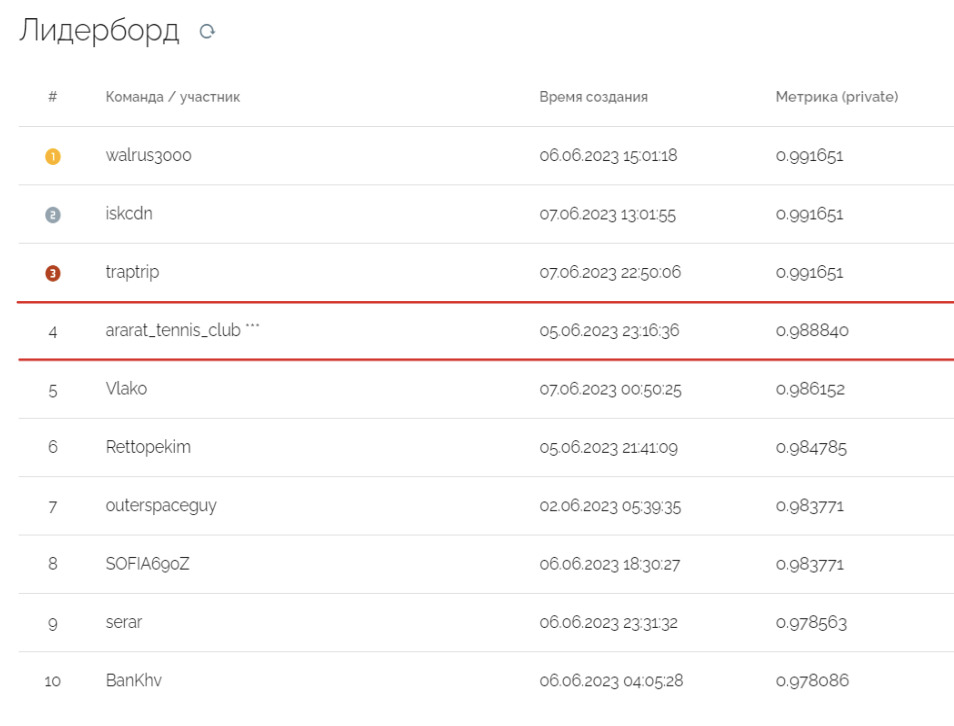

This repository contains a solution for the video analytics challenge organized by Sibur Digital, which was held from May 20 to June 7, 2023. 
It was required to develop an action recognition model to predict the current state of a railway tank. \
The key idea of the challenge was to develop a model that generalizes well on unseen data using a small dataset.

## Results

- **4th place** with 0.98884 F1 Macro

## Team ("ararat_tennis_club" on [leaderboard](https://platform.aitoday.ru/event/9)):

- Lavrentiy Grigoryan (https://www.linkedin.com/in/lawrencegrigoryan/)
- Vladislav Alekseev (https://www.linkedin.com/in/vladislav-alekseev/)
- Galina Burdukovskaya (https://www.linkedin.com/in/galina-burdukovskaia-7502ab21a/)

## Model requirements and limitations:

1. Classes: no_action, bridge_up, bridge_down, train_in_out 
2. Evaluation metric: F1 Macro
3. Only 496 videos in the dataset covering limited types of train stations, weather and situations
4. Test set contains 1200 samples, is more diverse and contains cases that differ a lot from train data including cases where some frames are randomly removed from the video (up to 25% of all frames can be removed)
6. Model runs on edge devices (camera) using just one CPU
7. Up to 18 minutes to score 1200 test videos (~0.9 sec for 1 video)

<video src="assets/samples.mp4"></video>

## Hypotheses tested

1. Average a video into one frame and classify just this one image
2. Classify whole videos (or some of its frames) using a 3D convolutional network
3. Object detection and its post-processing to classify videos

## Best approach

Though all the approaches above worked well enough, the first one provided us with our best model. 
We averaged the video using only every 50th frame (to better catch the moving train) and then trained a ResNet18 model pre-trained on ImageNet.

Some observations that allowed us to obtain a generalizable model with such a simple and fast approach:

1. **Longer training:** our best model converged at 97 epoch. Generally, we saw that training for 100+ epochs is optimal for model to generalize well
3. **Augmentations, augmentations and augmentations:** we used various types of image augmentations which really helped us to avoid overfitting
4. **Higher weight decay:** our best model was trained with 0.1 weight decay (helps with overfitting on such a small dataset)
5. **Manual train-val split:** we conducted EDA and noticed that not only the classes we are trying to predict are imbalanced but also camera locations, station types and some other conditions are imbalanced as well. So we manually created a train-val split which allowed us to both train a good model and also properly evaluate it on a representative validation set. The results of EDA are compiled into [dataset_located.xlsx](https://github.com/LawrenceGrigoryan/wagon-state-sibur/blob/main/data/dataset_located.xlsx)
6. **ONNX:** we converted our model to ONNX format and got a model that scores the whole test set in less than 5 minutes
