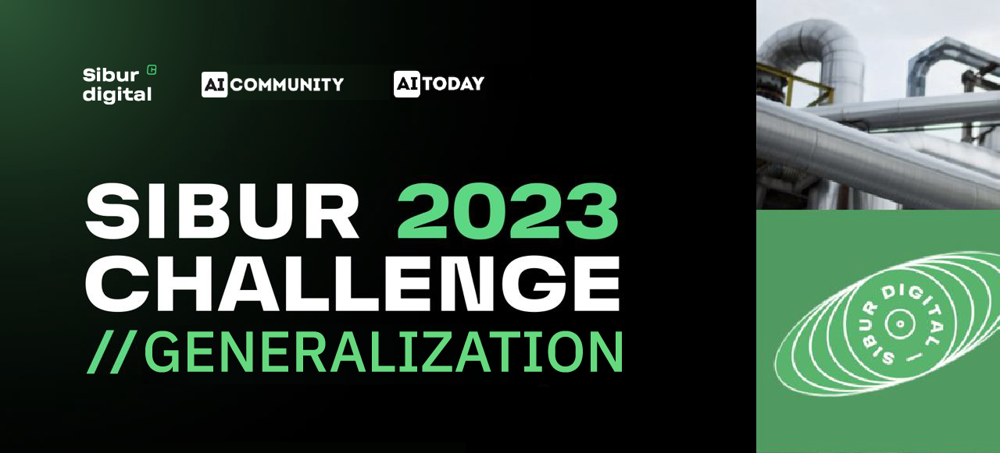

This repository presents a solution to the video analytics problem within the Sibur Digital challenge, which was held from May 20 to June 7, 2023. It was necessary to develop an action recognition model with a tank car on an overpass that traces the tank car's life cycle step by step (entry to the overpass, preparation for unloading, unloading, preparation for departure, train departure, and so on).

# wagon-state-sibur
Wagon state video analytics
